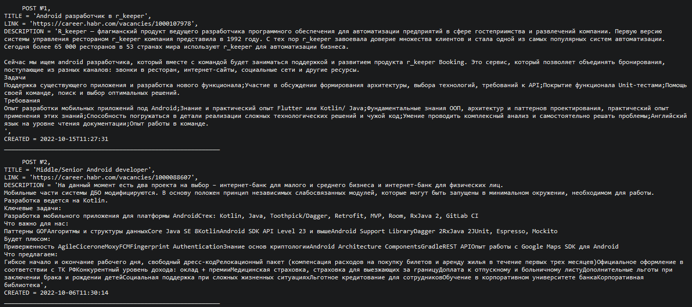
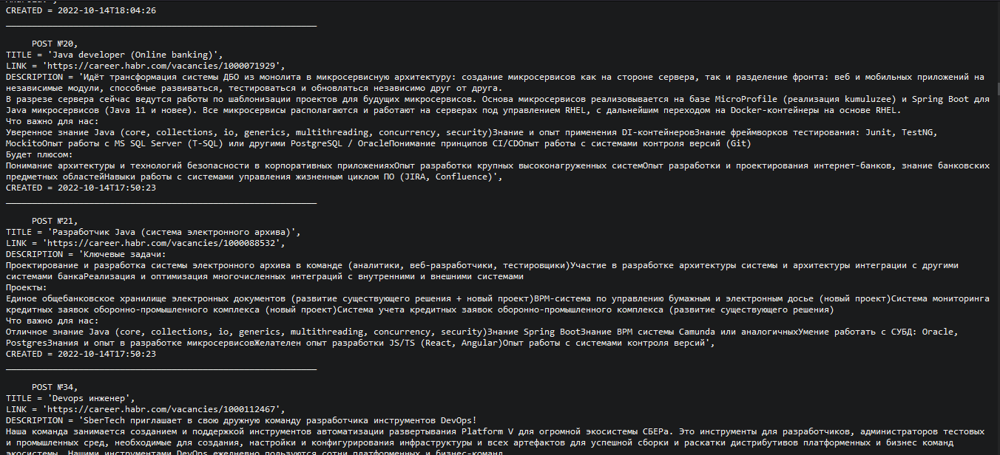

# Project "Job aggregator"
<p>This project represents basic Server Socket grabber from website</p>

### Functionality:
* Grabbing programmer vacancies from https://career.habr.com
* CRUD operations for vacancies
* Loading the page with vacancies using simple Server Socket in string representation of the jobs you found
* You can add new sites to the project without changing the code.
* You can make parallel parsing of websites.

### Assembly and installation:
1. Create "parser" database
2. Change your PostgreSQL database username and password in 'src/main/resources/app.properties'
and 'db/liquibase.properties'
3. You can change launch period and port in 'src/main/resources/app.properties'
4. Run commands below
```shell
mvn liquibase:update
mvn install -Dmaven.test.skip=true
java -jar target/grabber.jar
```
4. Open a browser and follow the link http://localhost:9000/ (port 9000 set by default)

### TODO list
1. The system starts according to the schedule - once a minute.
2. The launch period is specified in the settings - 'src/main/resources/app.properties'
3. The program reads all vacancies from the first 5 pages related to Java vacancies and writes them into the database.

### Used technologies:


### Screenshots



### Contact:
If you have any questions, feel free to contact me https://t.me/VadimDedeyko


<!-- 
brightgreen
green
yellowgreen
yellow
orange
red
blue
lightgrey
success
important
critical
informational
inactive
blueviolet
ff69b4
9cf 
-->